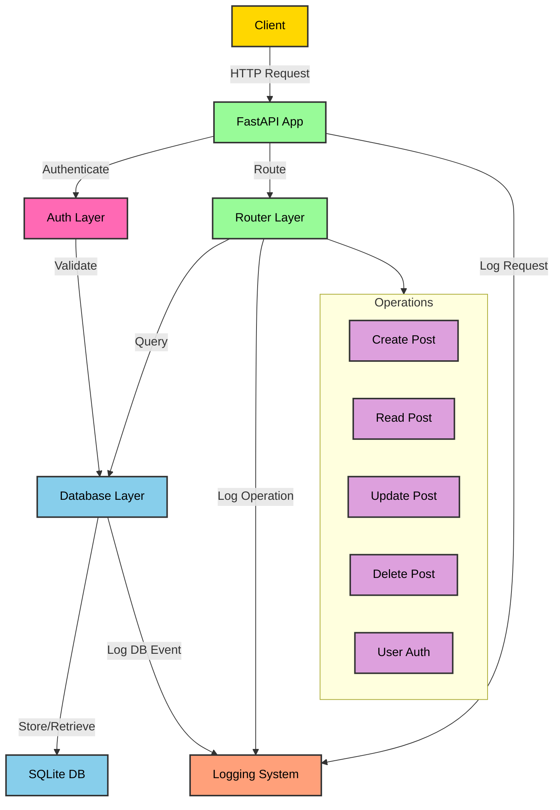

# Post Management API

A simple FastAPI application for managing posts with SQLite backend, user authentication, and comprehensive logging.

## Features

- User Management with JWT Authentication
- CRUD operations for posts (Create, Read, Update, Delete)
- Post ownership and authorization controls
- Paginated API responses
- SQLite database integration with SQLAlchemy
- Comprehensive logging system with file rotation
- Request timing and monitoring
- Input validation using Pydantic models
- Modern FastAPI practices with lifespan management

## API Flow Diagram



## Installation

1. Ensure Python 3.8+ is installed
2. Clone the repository
3. Install dependencies:
```bash
pip install fastapi uvicorn sqlalchemy pydantic python-jose[cryptography] passlib[bcrypt] python-multipart
```

## Project Structure
```
.
├── logs/                    # Application logs directory
│   └── app_YYYYMMDD.log    # Daily rotating log files
├── src/
│   ├── database/
│   │   ├── __init__.py
│   │   ├── config.py       # Database configuration and session
│   │   └── models.py       # SQLAlchemy database models
│   ├── models/
│   │   ├── __init__.py
│   │   ├── post.py         # Pydantic models for posts
│   │   └── user.py         # Pydantic models for users
│   ├── router/
│   │   ├── __init__.py
│   │   ├── post_router.py  # Post CRUD endpoints
│   │   └── user_router.py  # User management endpoints
│   └── utils/
│       ├── __init__.py
│       ├── auth.py         # Authentication utilities
│       └── logger.py       # Logging configuration
├── main.py                 # FastAPI application entry point
├── requirements.txt        # Project dependencies
└── README.md              # Project documentation
```

## API Endpoints

### Authentication
- `POST /users/register` - Register a new user
- `POST /users/login` - Login and get access token
- `GET /users/me` - Get current user information

### Posts
- `GET /posts` - List all posts (paginated)
  - Query parameters:
    - `skip`: Number of posts to skip (default: 0)
    - `limit`: Number of posts per page (default: 10, max: 100)
  - Returns:
    - `items`: List of posts
    - `total`: Total number of posts
    - `skip`: Current skip value
    - `limit`: Current limit value
- `GET /posts/{id}` - Get a specific post
- `POST /posts` - Create a new post (requires authentication)
- `PUT /posts/{id}` - Update an existing post (requires authentication, owner only)
- `DELETE /posts/{id}` - Delete a post (requires authentication, owner only)

## Running the Application

```bash
python main.py
```

The API will be available at `http://127.0.0.1:8000`

## Authentication

The API uses JWT (JSON Web Tokens) for authentication:
1. Register a new user with username and password
2. Login to receive an access token
3. Include the token in subsequent requests:
   ```
   Authorization: Bearer <your_access_token>
   ```

## Logging

Logs are stored in the `logs` directory with:
- Daily rotation
- 1MB file size limit
- 5 backup files retained
- Both file and console output
- Request timing information
- Operation tracking for all CRUD operations
- Authentication events logging

## API Documentation

- Swagger UI: `http://127.0.0.1:8000/docs`
- ReDoc: `http://127.0.0.1:8000/redoc`