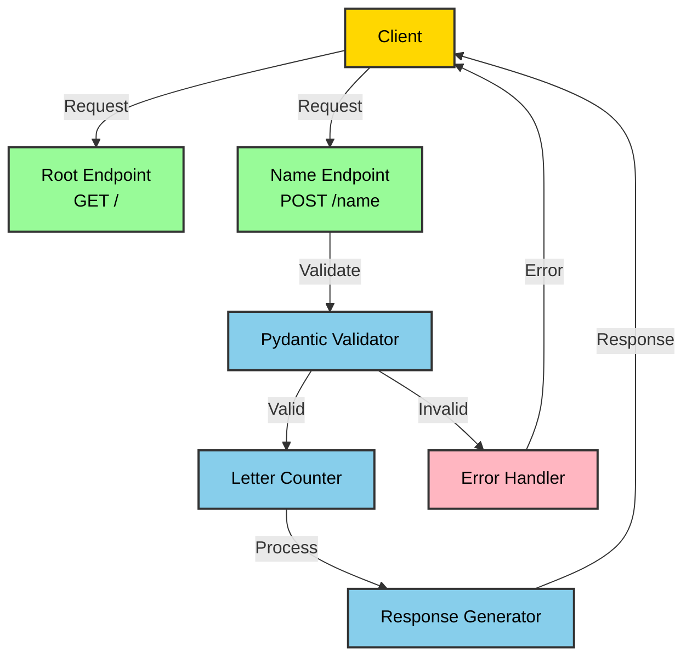

# Cursor Learn - FastAPI Name Processing Service

A simple FastAPI application that processes names and counts letter occurrences.

## Features

- RESTful API endpoints for name processing
- Letter frequency analysis
- Input validation using Pydantic models
- Comprehensive test coverage

## API Flow Diagram

## Installation

1. Ensure Python 3.13+ is installed
2. Install dependencies:

