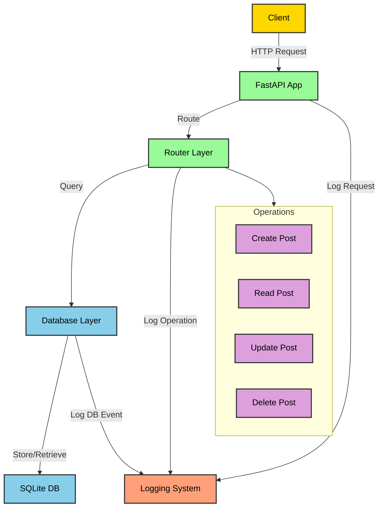

# Post Management API

A simple FastAPI application for managing posts with SQLite backend and comprehensive logging.

## Features

- CRUD operations for posts (Create, Read, Update, Delete)
- SQLite database integration with SQLAlchemy
- Comprehensive logging system with file rotation
- Request timing and monitoring
- Input validation using Pydantic models
- Modern FastAPI practices with lifespan management

## API Flow Diagram



## Installation

1. Ensure Python 3.8+ is installed
2. Clone the repository
3. Install dependencies:
```bash
pip install fastapi uvicorn sqlalchemy pydantic
```

## Project Structure
```
.
├── logs/                    # Application logs directory
│   └── app_YYYYMMDD.log    # Daily rotating log files
├── src/
│   ├── database/
│   │   ├── __init__.py
│   │   ├── config.py       # Database configuration and session
│   │   └── models.py       # SQLAlchemy database models
│   ├── models/
│   │   ├── __init__.py
│   │   └── post.py         # Pydantic models for request/response
│   ├── router/
│   │   ├── __init__.py
│   │   └── post_router.py  # Post CRUD endpoints
│   └── utils/
│       ├── __init__.py
│       └── logger.py       # Logging configuration
├── main.py                 # FastAPI application entry point
├── requirements.txt        # Project dependencies
└── README.md              # Project documentation
```

## API Endpoints

- `GET /` - Root endpoint with API information
- `GET /posts` - List all posts
- `GET /posts/{id}` - Get a specific post
- `POST /posts` - Create a new post
- `PUT /posts/{id}` - Update an existing post
- `DELETE /posts/{id}` - Delete a post

## Running the Application

```bash
python main.py
```

The API will be available at `http://127.0.0.1:8000`

## Logging

Logs are stored in the `logs` directory with:
- Daily rotation
- 1MB file size limit
- 5 backup files retained
- Both file and console output
- Request timing information
- Operation tracking for all CRUD operations

## API Documentation

- Swagger UI: `http://127.0.0.1:8000/docs`
- ReDoc: `http://127.0.0.1:8000/redoc`